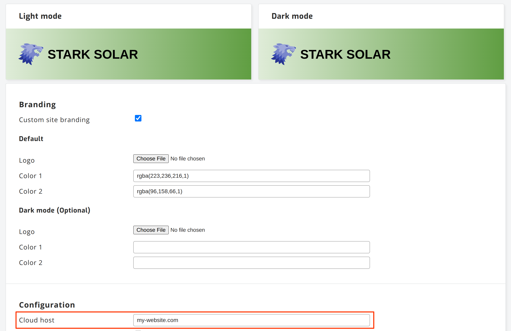
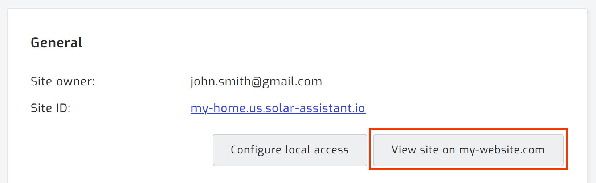

# SolarAssistant: Web Integration Kit

SolarAssistant gives every organization a choice of ready-made **cloud web portal**
templates out of the box. This repository is for when you want to customize or
build your own, integrating SolarAssistant sign-in, sites, and user management
directly into a website you run (a custom site, **WordPress**, **Joomla**,
Webflow, plain HTML, and more). We believe a custom web portal is an essential part of
your solar business. [Read more on why we think so](docs/approach.md).

## Prerequisites

Configure the **Cloud host** on your SolarAssistant organization to your domain. Every site linked to your organization will provide the end user with links to your domain instead of solar-assistant.io. These are registering a site (`/sites/register`) and viewing a site (`/sites/:id`).

 

## Choose your level of control

| | **Web Components** | **API Client** |
|---|---|---|
| **Package** | `@solar-assistant/components` | `@solar-assistant/api` |
| **Installation** | Place a `<script>` tag on any page. The elements self-register. No code to write. | Place a `<script>` tag on any page. `SolarAssistant.apiClient` is available globally. |
| **Example usage** | `<sa-sites sign-in="/sign_in"></sa-sites>` | `const api = SolarAssistant.apiClient(token)`<br>`const sites = await api.get('/sites').then(r => r.json())`<br>*… render sites from JSON data …* |
| **Customization** | CSS only: colors, borders, and corner radius via CSS variables. | Unlimited. You own the markup and styles. |
| **Guide** | [Components guide →](docs/components.md) | [API reference →](docs/api.md) |

Further reading: [Authentication & auth transfer](docs/authentication.md) · [Customizing outlets](docs/customizing.md) · [Locale & translations](docs/i18n.md)

Both are framework-agnostic and ship from this repository. Pick per page, or mix them.

## Start from a working example

[`examples/default/`](examples/default/) is a complete, ready-to-serve portal —
sign in, list sites, view a site, invite users, and manage the account — built
entirely from the components. Copy the folder, replace a few placeholders (org id,
logo, brand colours), and serve it as a static site.

The components load straight from the CDN, so there's no build step:

```html
<script type="module" src="https://cdn.solar-assistant.io/js/solar-assistant.js"></script>
```

## Development

> Integrators don't need this section. Just include the script from the CDN
> above. This is for working on the components themselves.

An npm workspaces monorepo:

```
packages/
  api/         @solar-assistant/api         (no build step, plain ES module)
  components/  @solar-assistant/components   (imports @solar-assistant/api)
```

```bash
npm install
```

Two files are published to `cdn.solar-assistant.io/js/`:

- `solar-assistant.js` — ES module, components + API client, built from `packages/components/src/index.js`
- `solar-assistant-api.js` — IIFE, API client only, exposes `window.SolarAssistant`
